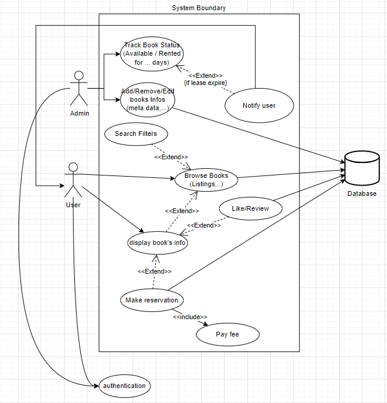

# Diagrams
_Notes: all files ending with `.drawio.png` can be opened and edited using draw.io_

## Use case _(still need to put authentication inside the sys bondary)_:

## Use Case Description tables

Description_table_-_Add_Edit_Book.png

Description_table_-_Borrow_Book.png

Description_table_-_Browse_Book.png

Description_table_-_Filter_Book.png

Description_table_-_Like_and_Review_Book.png

Description_table_-_Login.png

Description_table_-_Pay_Overdue_Fee.png

Description_table_-_Remind_mail.png

Description_table_-_Rental_Orders.png

Description_table_-_View_A_Book.png

Description_table_-_View_Book_List.png

Description_table_-_View_List_Of_Book_On_Main_Menu.png

## Sequence diagrams

Sequence_Diagram_-_Add_or_Edit_A_Book.png

Sequence_Diagram_-_Like_and_Review_Book.png

Sequence_Diagram_-_Retrieve_Borrow_Order.png

Sequence_Diagram_-_Send_Email_When_Order_Expired.png

Sequence_diagram-Borrow_book.png

Sequence_diagram-Browse_book.drawio.png

Sequence_diagram-Filter_book.png

Sequence_diagram-Forget_a_password.png

Sequence_diagram-Login_an_account.png

Sequence_diagram-Pay_overdue.png

Sequence_diagram-Register_a_new_account.png

## ER Diagram:
### V1.0:

### V2.1:

## Deployment Diagram:

