# **Introduction** 

 Access to academic resources and materials is required for students
 and lecturers to support their education. As a result, a dependable
 library management system is a must-have in every university and
 college. There, students and lecturers can browse, borrow, and manage
 books using their own devices, which is useful and convenient for them
 to keep track of their book's status, such as due date and loan
 charge. Not only must it provide the aforementioned essential
 purposes, but it must also be visually appealing and consistent in
 order to attract students and withstand high Internet traffic.
 Building such a system necessitates meticulous planning and
 trial-and-error due to its vast size of service.

# **Objectives**

 This project deals with the creation and operation of an online
 library, with the additions and experiments from our teammate’s
 feature proposal. Besides basic functionalities such as book listing,
 issuing and returning books, sending overdue messages via emails,
 paying overdues, the project also introduces some features like admin
 management dashboard, and book reviews from past readers. However,
 since this is a project on a small, non-commercial scale and the time
 allotted to this project was limited, the final product might serve as
 a demonstration for essential requirements and could not be
 well-represented as a true library management system which could be
 implemented among universities and colleges.

# **Acknowledgements**

 We owe our gratitude to Prof. Huynh Trung Hieu, our lecturer and
 instructor in this Programming Exercises module. Thanks to his
 guidance and timely support, we can set our project’s orientation and
 apply the software engineering ethics into our project. On this
 occasion, we would also like to express our sincere thanks to Truong
 Vinh Hoang Chau (CSE2019), a senior in the same major as us. Without
 his prior experience about the project, particularly in Node.js, we
 would not have been able to easily identify and learn about technical
 terms and references in the early phases, allowing us to move on to
 coding stages sooner than envisaged.

# **Teamwork**

<table
<colgroup>
<col style="width: 34%" />
<col style="width: 65%" />
</colgroup>
<thead>
<tr class="header">
<th><strong>Name<br />
(ID)</strong></th>
<th><strong>Tasks</strong></th>
</tr>
<tr class="odd">
<th>Truong Vinh Hoang Chau<br />
(16076)</th>
<th><ul>
<li><blockquote>
<p>Provide basic orientations, reference materials essential to start
the project smoothly.</p>
</blockquote></li>
<li><blockquote>
<p>Provide some consultancy and feedback.</p>
</blockquote></li>
</ul></th>
</tr>
<tr class="header">
<th>Vo Nguyen Minh Duy<br />
(17105)</th>
<th><ul>
<li><blockquote>
<p>Majorities of UI re-decoration for Admin Pages</p>
</blockquote></li>
<li><blockquote>
<p>Admin’s Add, Edit and Remove Book and/or User function</p>
</blockquote></li>
<li><blockquote>
<p>Use Case diagrams and Description Tables</p>
</blockquote></li>
<li><blockquote>
<p>Chart for Admin Dashboard</p>
</blockquote></li>
</ul></th>
</tr>
<tr class="odd">
<th>Do Dinh Dong<br />
(17000)</th>
<th><ul>
<li><blockquote>
<p>Login/Register</p>
</blockquote></li>
<li><blockquote>
<p>Forgot/Reset password</p>
</blockquote></li>
<li><blockquote>
<p>Send email to users</p>
</blockquote></li>
<li><blockquote>
<p>Report writing</p>
</blockquote></li>
</ul></th>
</tr>
<tr class="header">
<th>Tra Dang Khoa<br />
(17637)</th>
<th><ul>
<li><blockquote>
<p>.Front-End:</p>
</blockquote>
<ul>
<li><blockquote>
<p>Homepage</p>
</blockquote></li>
<li><blockquote>
<p>User profile</p>
</blockquote></li>
<li><blockquote>
<p>Book detail (information)</p>
</blockquote></li>
</ul></li>
<li><blockquote>
<p>.Back-End:</p>
</blockquote>
<ul>
<li><blockquote>
<p>Review function</p>
</blockquote></li>
<li><blockquote>
<p>Update account function</p>
</blockquote></li>
<li><blockquote>
<p>Help with the book management functionality</p>
</blockquote></li>
<li><blockquote>
<p>Check due date middleware</p>
</blockquote></li>
</ul></li>
</ul></th>
</tr>
<tr class="odd">
<th>Tran Hoang Kim<br />
(17251)</th>
<th><ul>
<li><blockquote>
<p>Use Case description tables</p>
</blockquote></li>
<li><blockquote>
<p>Use case diagrams</p>
</blockquote></li>
<li><blockquote>
<p>UI design: Payment pages, Search page</p>
</blockquote></li>
<li><blockquote>
<p>Payment function</p>
</blockquote></li>
</ul></th>
</tr>
<tr class="header">
<th>Mai Trong Nhan<br />
(17565)</th>
<th><ul>
<li><blockquote>
<p>Sequence diagrams</p>
</blockquote></li>
<li><blockquote>
<p>Prototype UI design</p>
</blockquote></li>
<li><blockquote>
<p>Basic functionalities for Admin pages</p>
</blockquote></li>
<li><blockquote>
<p>Basic functionalities for User Book Management page</p>
</blockquote></li>
</ul></th>
</tr>
<tr class="odd">
<th>Nguyen Huu Minh Quang<br />
(17452)</th>
<th><ul>
<li><blockquote>
<p>Register and login for users.</p>
</blockquote></li>
<li><blockquote>
<p>Register and login for admin for testing.</p>
</blockquote></li>
<li><blockquote>
<p>Create function for the search bar on the Home page and Search
page</p>
</blockquote></li>
</ul></th>
</tr>
<tr class="header">
<th>Nguyen Thanh Son<br />
(18874)</th>
<th><ul>
<li><blockquote>
<p>Design/Implement database</p>
</blockquote></li>
<li><blockquote>
<p>Added Dockerfile</p>
</blockquote></li>
</ul></th>
</tr>
</thead>
<tbody>
</tbody>
</table>

# **User requirements**

 (Vo Nguyen Minh Duy - 17105, Tran Hoang Kim - 17251)

## **Overall Use case**

 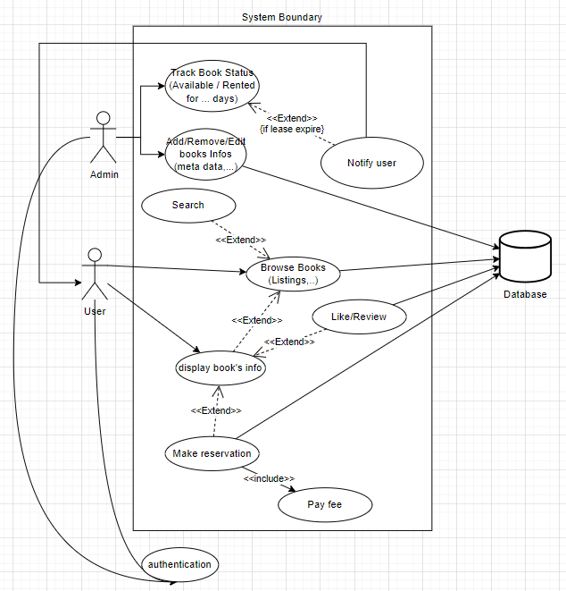

## **Use case of detail function**

### **Login/Register**

 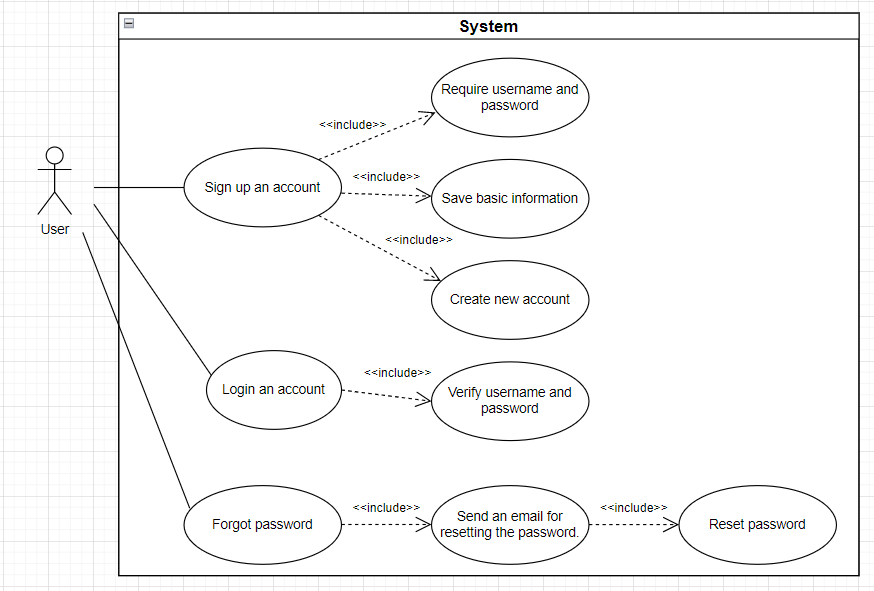

### **Book information**

 

### **View a book**

 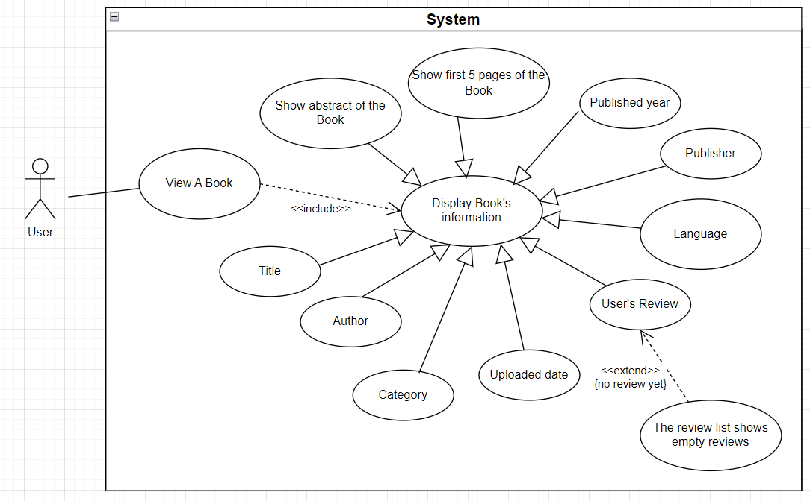

### **Borrow book**

 Chưa sửa

 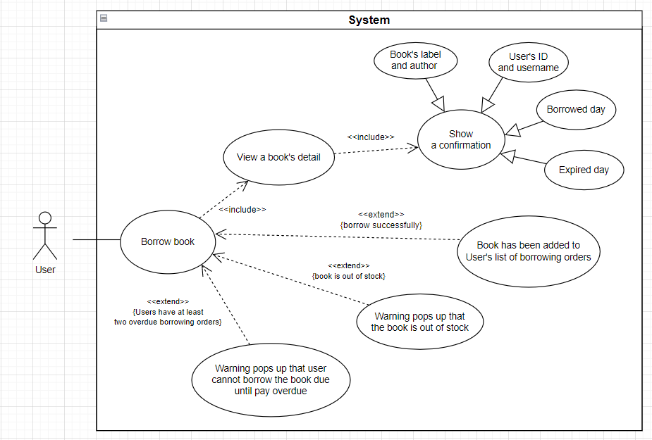

### **Book cart (book management)**

 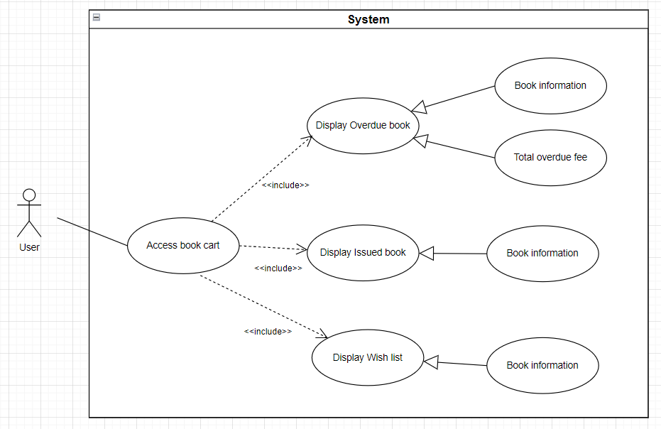

### **Like/ Dislike and Review book**

 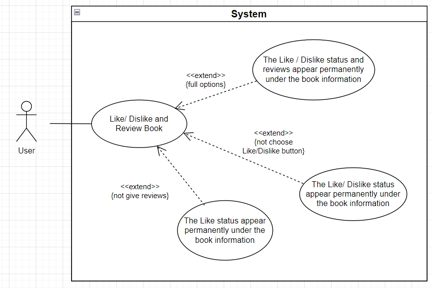

### **Pay overdue**

 

### **Add and edit book**

 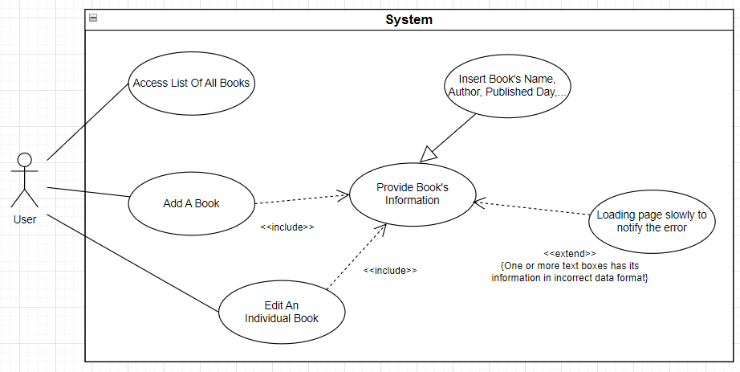

# **System analysis**

##  **Folder structure**

 (Nguyen Thanh Son - 18874)

 Our project reference a lot from the project in the reference material
 provided by Mr. Chau, and has thus taken a directory structure akin to
 its implementation:

 **Code (bash):**

 ```bash

 $ # list all the directories in the project's git repository
 $ tree --gitignore -d .
 .
 |-- controllers
 | `-- admin
 |-- data
 |-- middleware
 |-- models
 |-- public
 | |-- assets
 | |-- components
 | |-- css
 | |-- js
 | |-- playground_assets
 | `-- upload
 `-- views
 |-- admin
 | `-- components
 `-- layouts

 16 directories
 ```

 The main file that will called upon all the other components
 (index.js) lives in the project's root.The rest of the folder is
 rather self-explanatory: The "controllers" houses all of the
 controller for the web page, the "views" folder contains all the files
 with .ejs extension that will be rendered into html upon the user's
 request, all of the middlewares lives in the similarly named folder
 and the database blueprints for mongoose all stayed in the "models"
 folder. Another thing to note, as the project uses the ExpressJS
 framework, all of the publicly accessible resources (front-end
 Javascript and Cascading Style Sheet files, pictures on the website,
 etc.) are placed in the "public" folder, as per the default for this
 framework.

## **MVC Architecture**

 (Nguyen Thanh Son - 18874)

 The MVC, or "Model-View-Controller", is one of the system
 architectural design patterns of modern times. It divides the moving
 parts of a software project into three main components:

- The Controller receives incoming requests from clients, the process and directs the other two components to form corresponding 
responses.

- The Model manages all of the data used by the project and only interacts with the Controller.

- The View component, also communicating only with the Controller, deals with formulating data into a visual representation.

 Our project takes a thin client approach of this model, commonly used
 in web design; in which practically all of the Model, View and
 Controller logic stays on the server, and the client only concerns
 with sending the hyperlink requests, form submissions and rendering
 the returning html from the server.

## **User Interface (UI)**

 (Tran Hoang Kim - 17251)

 We use the Figma website to design all User Interface (UI) of the
 website in order to have an overview of all UI and adjust them easily
 before coding those.

 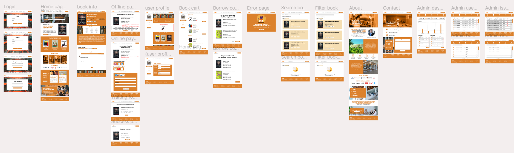

 Then, we added the TeleportHQ extension in Figma to convert our
 designs to HTML and CSS codes. This tool can convert 80% of the origin
 design so that we have to adjust the pages according to the design in
 Figma. In the TeleportHQ website, we can drag and drop the elements
 (e.g. button, menu, label, text …). Almost all classes in HTML codes
 are <span> so we have to change the type of classes depending on
 their functions in the website design.

 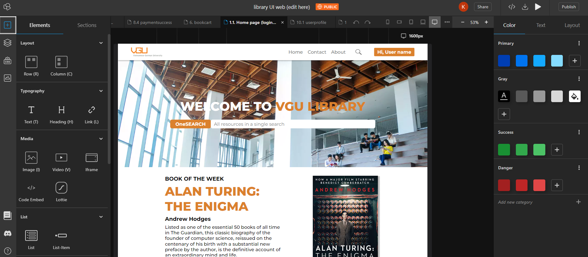

## **Deployment Method**

 (Vo Nguyen Minh Duy - 17105)

 In order to deploy the application to a cloud server and have it
 running 24/7, we use Vultr cloud service which provides us with
 convenient 1TB storage and 2TB bandwidth cloud server at a cheap
 price. After creating the account and choosing few minimal options for
 the cloud server, we finally settle with the following instance
 information:

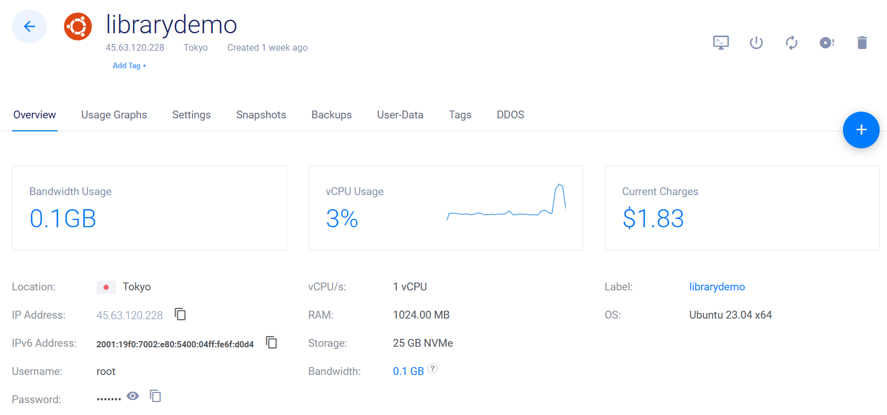

 Although Vultr provides us with an Ubuntu terminal in order to modify
 our instance, the server can also be accessed from the command prompt
 window in our laptop when applying sufficient login credentials and
 password.

 

 In order to get the application running on the server, firstly the
 NodeJS package is installed:

- Install NVM:

 curl -o-
 https://raw.githubusercontent.com/nvm-sh/nvm/v0.35.3/install.sh |
 bash

- Install Nodesource:

 nvm install 14.4.0

- Install NodeJS:

 sudo apt-get install -y nodejs

 Secondly, the procedure moves on to MongoDB installation:

- Install gnupg:

 sudo apt-get install gnupg

- Import MongoDB public GPG key:

<table>
<colgroup>
<col style="width: 100%" />
</colgroup>
<thead>
<tr class="header">
<th><blockquote>
<p>curl -fsSL https://pgp.mongodb.com/server-6.0.asc | </p>
</blockquote></th>
</tr>
<tr class="odd">
<th><blockquote>
<p>sudo gpg -o /usr/share/keyrings/mongodb-server-6.0.gpg </p>
</blockquote></th>
</tr>
<tr class="header">
<th><blockquote>
<p>--dearmor</p>
</blockquote></th>
</tr>
</thead>
<tbody>
</tbody>
</table>

- Create list file for MongoDB

<table>
<colgroup>
<col style="width: 100%" />
</colgroup>
<thead>
<tr class="header">
<th><blockquote>
<p>echo "deb [ arch=amd64,arm64
signed-by=/usr/share/keyrings/mongodb-server-6.0.gpg ]
https://repo.mongodb.org/apt/ubuntu jammy/mongodb-org/6.0 multiverse" |
sudo tee /etc/apt/sources.list.d/mongodb-org-6.0.list</p>
</blockquote></th>
</tr>
</thead>
<tbody>
</tbody>
</table>

- Reload local package data:

> sudo apt-get update

- Install MongoDB package:

> sudo apt-get install -y mongodb-org

- Start MongoDB:

> sudo systemctl start mongod

 After installing every package needed to run the application, the
 application source code from Gitlab is cloned to the directory inside
 the server, preferably specified.

 The command is shown below:
```bash
 $ git clone -b temporaryMain
 https://gitlab.com/galvdat/vgu_tinyprojects/pe2023/vgupe2023_team3.git
 /var/apps/actual
 ```

 Next the terminal needs to set its working directory at the folder
 where index.js is located. The index.js is served as application
 launcher and in order to specify correctly which file the command npm
 will run, the main terminal needs to reach index.js’s root folder. The
 command for redirecting to the launcher’s folder as well as running
 the application are show below:

 > cd '/var/apps/actual/online libray management'
 
 > node index.js

 Additionally, PM2, a process manager for NodeJS applications, fully
 written in Shell and NodeJS, is installed in order to keep our
 application running stably, reloading and restarting smoothly with
 zero downtime. The command to install PM2 is shown below:

 ```bash
 $ sudo npm install -g pm2
 ```

 After installing PM2, index.js file can be binded to PM2 manager to
 keep the whole application permanently running. Since it requires the
 specific file index.js itself, the terminal needs to set its current
 directory to the folder containing index.js, as said above.

 ```bash
 $ pm2 start index.js

 $ pm2 list
```

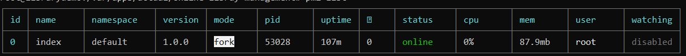

 The final step of enabling the server to accept global connections
 from any machine is to enable open the application port in
 UncomplicatedFirewall (UFW). The following commands are used to
 accomplish such a task.

 ```bash
 $ sudo ufw enable

 $ sudo ufw allow 3000

 $ sudo ufw reset
 ```

 Finally, any user can now access our application by entering into the
 address bar the following format, our cloud server’s address : our
 application port. In this case the address will be
 [<u>http://45.63.120.228:3000</u>](http://45.63.120.228:3000). It does
 not require anything to access this link rather than the literal link
 itself.

 Since our application does not contain any embedded data of the local
 MongoDB from our machine, the Admin user needs to work on initializing
 many Books data and Users data, if necessary. However any changes made
 by different users from different machines will be sent to the only
 one database initialized and accessed by our application.

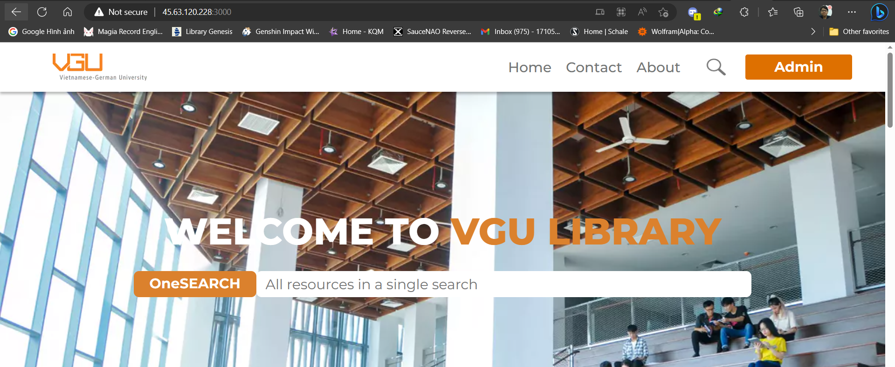

## **Login/Register**

 (Do Dinh Dong - 17000)

 Users can login as a normal user or admin. In the Login page, after
 the user submits the username and password, the system will find the
 username and hashed password on the database. If both are matched, the
 system will route to the homepage, with the username shown on the Hi
 <username> box.

 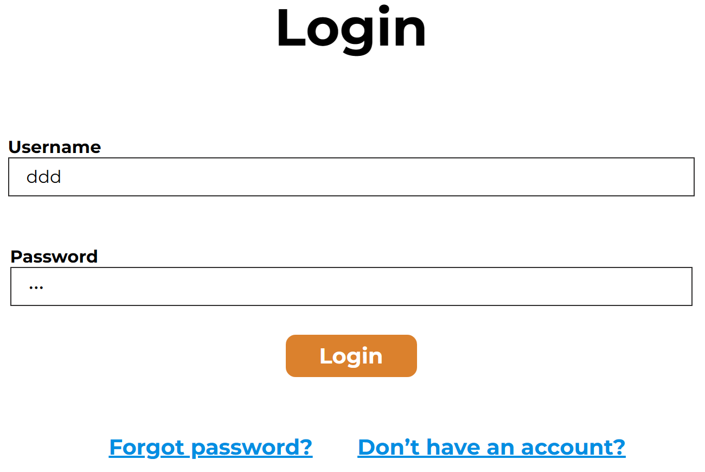

Navigation bar after login:


 To register an account, the user goes to the Login page and clicks the
 “Don’t have an account?” button to redirect to the Register page. The
 user provides their name, email address, username and password. Then,
 the system saves them as a new record to the database.

 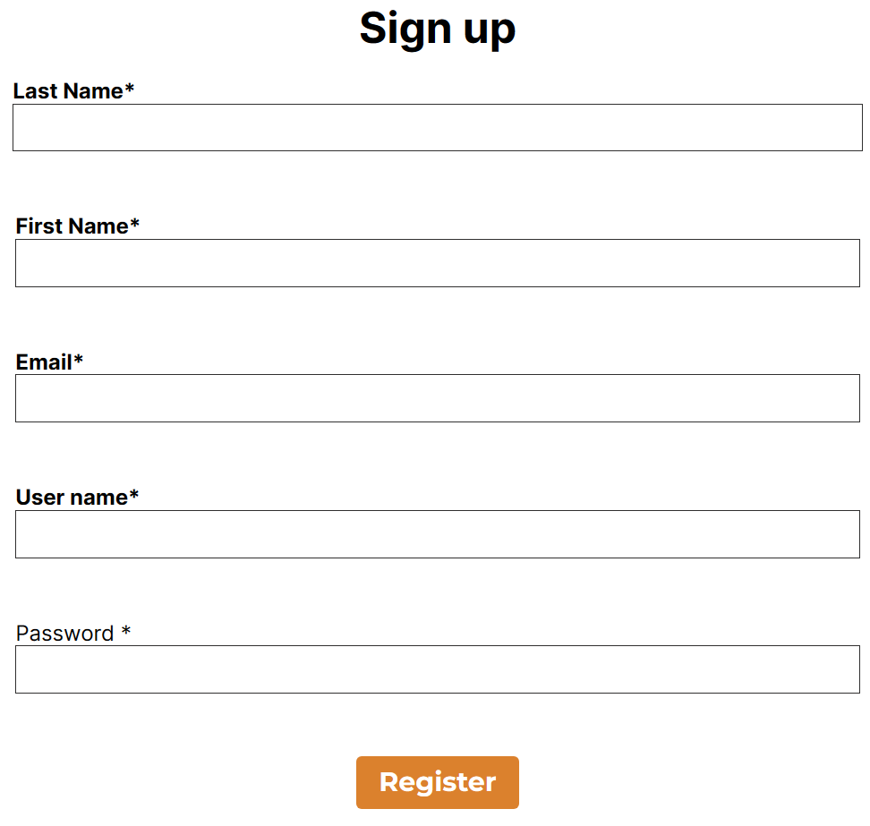

## **Reset password**

 (Do Dinh Dong - 17000)

 In the “Send confirmation email” page, user types in the email
 address. If that email exists in the database, the system sends the
 password reset link to the user’s email. Else, the system routes back
 to the send confirmation email page.

 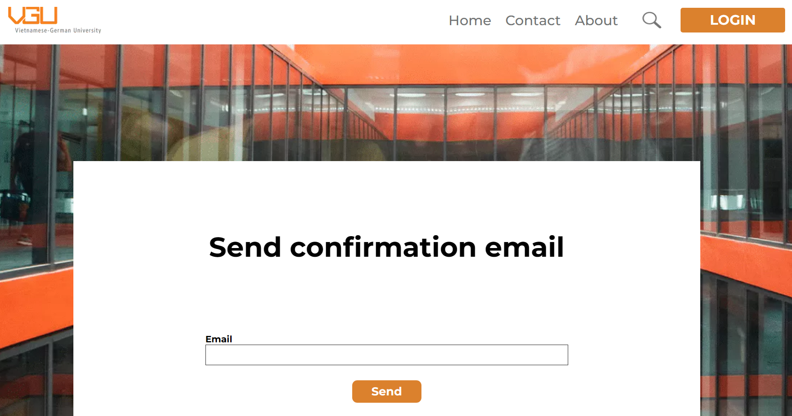

 Clicking the link sent to the user’s email will bring the user to the
 Password reset page.

 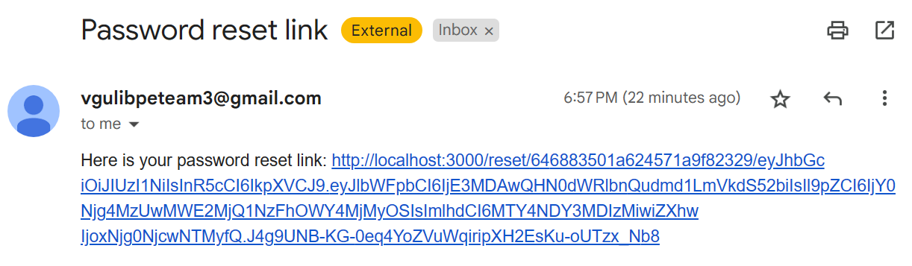

 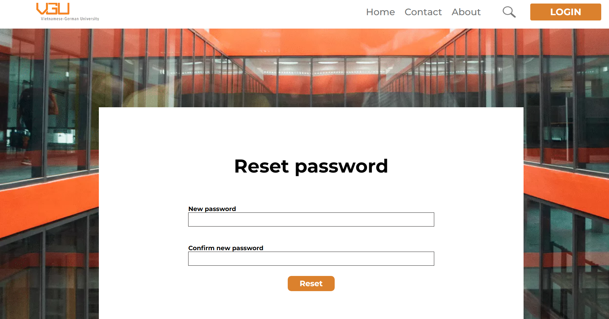

## **Send email**

 (Do Dinh Dong - 17000)

 System sends email to the user to notify book overdue status or reset
 the password. We display the function in the *sendEmail.js* code
 below:
```Javascript
 const nodemailer=require('nodemailer')

 module.exports=async function sendEmail(recipient,subject,text){

 const transporter=nodemailer.createTransport({

 service:'gmail',

 auth:{

 user:'vgulibpeteam3@gmail.com',

 pass:'********' //hidden for security

 }

 })

 const info=await transporter.sendMail({

 from:'vgulibpeteam3@gmail.com',

 to:recipient,

 subject:subject,

 text:text

 })

 console.log('Message sent: '+info.messageId)

 }
 ```

## **Update user account information**

 (Tra Dang Khoa - 17637)

 This simple function allows the user to update their account
 information and profile picture. When a user logged in, they can
 access this function by clicking the login button (which now has
 turned into “Hi username” button). This will lead the user to a user
 profile by the route "/user_profile" in navbar.esj in the layout
 folder.

 

 This will render the user profile. Users can access the account page
 by clicking on the “Account” on the user navigation column on the left
 of the page. We link the Account with route “/user_profile_setting”.

 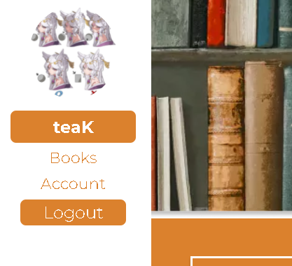

 When entering the account setting page. Users can now edit their
 general account information by clicking on the edit button. This will
 call the script edit.js to enable the edit.

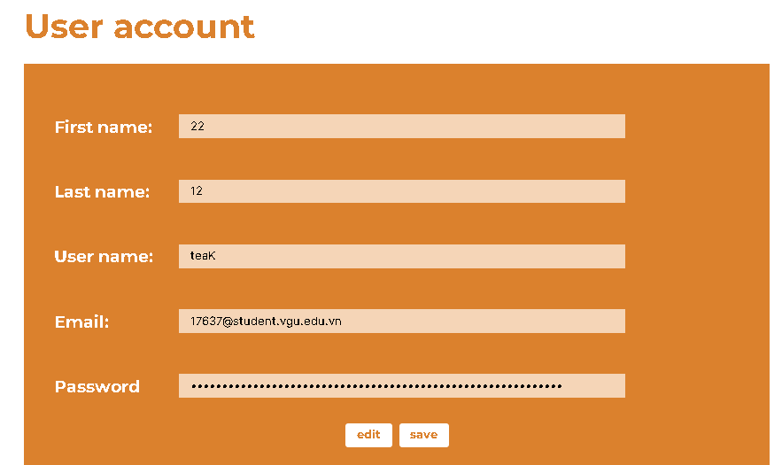

 ```javascript

 function _t(id) {

 return document.getElementById(id);

 }

 var hey = document.querySelectorAll('input')

 let btn1 = _t('startEditing');

 btn1.onclick = function(){

 //check the input element is readOnly or not

 console.log("sucess")

 for (let i = 0; i < hey.length; i++) {

 if( hey[i].readOnly== true) {

 hey[i].readOnly =false

 hey[i].style.backgroundColor ='#ffffff'

 } else {

 hey[i].readOnly =true

 hey[i].style.backgroundColor ='#f5d5b7'

 }

 }

 }

 ```

 After the player input the new info. They need to click the save
 button to submit to the database. This will call updateAccount.js.

 This code makes the submit smoother without having to redirect into
 another route.

 ```javascript

 $('#change').submit(function(e){

 var formData = $('#change').serialize();

 e.preventDefault();

 $.ajax({

 url: "/users/change",

 type: 'post',

 data : formData,

 success: function(respond){

 alert(respond.text);

 console.log("hi")

 }

 });

 return false;

 });

 ```

 The "/users/change" route will lead to the updateAccount.js controller
 to update the database.

 ```javascript

 const User = require('../models/User')

 const path = require('path')

 module.exports = (req, res) => {

 const username = user1;

 User.findOneAndUpdate({username: username}, req.body, {upsert:
 true})

 .then((user)=>{

 console.log("yo");

 res.send({

 text:"sucess"

 });

 })

 .catch((error,user) =>{

 console.log(error,user)

 })

 }

 ```

 And that's all for updating general account information.

 Update image function is a little bit different from update general
 information. Update image profile doesn't have an edit button and when
 clicking the save button, instead of calling the updateAccount.js
 script, it will simply submit the form to the route
 "/users/changeImage".

 

 This will run an updateAccountImage.js controller to store images into
 route public/upload/.

 ```javascript

 const User = require('../models/User')

 const path = require('path')

 module.exports = (req, res) => {

 console.log(req.files);

 if(!req.files) console.log('Nothing');

 let { iconLink } = req.files;

 iconLink.mv(path.resolve(__dirname,'..' ,'public/upload',
 iconLink.name), function (err)

 {

 const username = user1;

 User.findOneAndUpdate({username: username}, {...req.body, iconLink:
 '/upload/' + iconLink.name}, {upsert: true})

 .then((user)=>{

 console.log("yo");

 res.redirect('/user_profile_setting')

 })

 .catch((error,user) =>{

 console.log(error,user)

 })

 })

 }

 ```

## **Review book**

 (Tra Dang Khoa - 17637)

 The book review section in the book-info page allows users to input
 their review to a book. In this, socket.io.js is used to enable real
 time updates. Meaning that users can see their submitted review right
 away.

 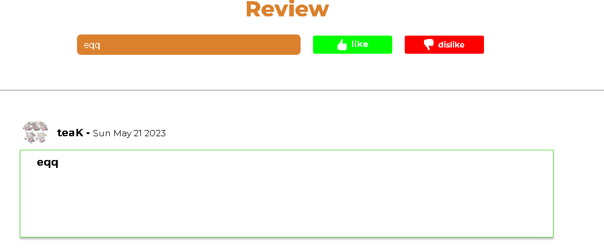

 First, the likeAnddislike.js script will run when clicking on dislike
 or like button, after the users input the review.

 ```javascript

 function _t(id) {

 return document.getElementById(id);

 }

 let input = _t('rating');

 let like= _t('like');

 let dislike =_t('dislike')

 like.onclick = function(){

 console.log("sucess")

 input.value = "Recommended"

 }

 dislike.onclick = function(){

 console.log("sucess")

 input.value = 'Not Recommended'

 }

 ```

 This script will check what rating did the user choose, dislike or
 like then change the input rating value to corresponding user’s
 choice. After that, doComment.js will be called to enable submitting
 forms without redirection.

 ```javascript

 $('#review').submit(function(e){

 var formData = $('#review').serialize();

 var userName =
 document.getElementById('writtenBy.userName').value;

 var body = document.getElementById('body').value;

 var rating = document.getElementById('rating').value;

 var title = document.getElementById('title').value;

 e.preventDefault();

 $.ajax({

 url: "/users/review",

 type: 'post',

 data : formData,

 success: function(respond){

 formData._id = respond._id;

 socket.emit("new_comment", formData, userName, body, rating,
 title);

 alert(respond.text);

 console.log("hi")

 }

 });

 return false;

 });

 ```

 The script will get the input data and send it to route
 "/users/review" to store the review content.

 ```javascript

 const Review = require('../models/Review')

 module.exports=(req,res) =>{

 Review.create(req.body)

 .then(()=>{

 res.send({

 text:"sucessfully send"

 });

 })

 }

 ```

## **Add wishlist**

 (Tra Dang Khoa - 17637)

 
 or this
 

 Add to wishlist function simply allows users to mark their favorite
 book for borrowing later on. When clicking on the wishlist button, it
 will submit the form into route “ /users/wishlist ” and run
 AddToWishlist.js.

 ```javascript

 const WishList = require('../models/WishList')

 module.exports=(req,res) =>{

 if(loggedIn){

 console.log(req.body)

 let uid= req.body.userID;

 console.log(req.body.userID);

 let book = {

 'bookID': req.body.bookID,

 'bookName': req.body.bookName,

 'Author': [req.body.Author]

 }

 console.log(req.body.Author);

 console.log(book);

 WishList.findOneAndUpdate({'userID': uid}, {$push: {'books':
 book}},{upsert:true})

 .catch((error)=> console.log(error))

 .then((book)=>{

 res.redirect('/index')

 })

 } else {

 console.log(req.body)

 res.send({

 text:"please login bro"

 });

 }

 }

 ```

## **Book slider**

 (Tra Dang Khoa - 17637)

 The swiper.js script is used to enable the book slider on the home
 page. First the swiper.js main script is imported in the script.ejs
 layout.

 ```xml

 <script
 src="https://cdn.jsdelivr.net/npm/swiper@9/swiper-bundle.min.js"></script>

 ```

 Then import script.js

 ```html

 <script src="/js/script.js"></script>

 ```

 After that, script.js will run when loading a page.

 ```javascript

 var swiper = new Swiper(".home-the-slide-content", {

 slidesPerView: 1,

 spaceBetween: 0,

 loop: true,

 centerSlide: 'true',

 fade: 'true',

 grabCursor: 'true',

 pagination: {

 el: ".swiper-pagination",

 clickable: true,

 dynamicBullets: true,

 },

 navigation: {

 nextEl: ".swiper-button-next",

 prevEl: ".swiper-button-prev",

 },

 breakpoints:{

 0: {

 slidesPerView: 1,

 },

 520: {

 slidesPerView: 2,

 },

 950: {

 slidesPerView: 3,

 },

 1600: {

 slidesPerView: 4,

 },

 },

 });

 ```

## **Check Due date**

 (Tra Dang Khoa - 17637)

 This middleware will be activated before loading the homepage to check
 if the current date is 1 days before the due date, if yes it will send
 an email to the user to warn about the due date. It also checks if
 today is a due date, if yes then update status of that book to
 overdue.

 ```javascript

 const Borrow = require("../models/BorrowRecord");

 const Users = require("../models/User.js");

 const sendEmail=require('../controllers/sendEmail')

 module.exports = (req, res, next) => {

 Promise.all

 ([

 Users.find(),

 Borrow.find(),

 ])

 .then(([user, borrow]) => {

 //caculate the date

 if (user.length != 0 && borrow.length !=0) {

 var dif = []

 var due = []

 for (var i = 0; i < borrow.length; i++) {

 var now = new Date().getTime();

 dif[i] = (Math.abs(now - borrow[i].createdAt)) / (1000 * 3600
 * 24);

 due[i] = (Math.abs(borrow[i].dueDate - borrow[i].createdAt)) /
 (1000 * 3600 * 24);

 // dif[i] = 0;

 // due[i] = 0;

 console.log(dif[i])

 console.log(due[i])

 if (dif[i] != due[i] && due[i]- dif[i] <= 1 ){

 console.log("one or less than one day left")

 for (var k = 0; k < user.length; k++) {

 if (user[k]._id.equals(borrow[i].userID) ){

 console.log("help")

 sendEmail(user[k].email,

 'Password reset link', 'the book is almost due bro'

 )

 }

 }

 } else if (dif[i] == due[i] ){

 console.log("time out")

 for (var k = 0; k < user.length; k++) {

 if (user[k]._id.equals(borrow[i].userID) ){

 console.log("help")

 borrow[i].overDue = true

 borrow[i].paymentAmount = 100;

 borrow[i].status = "overdue";

 borrow[i].save()

 }

 }

 }

 }

 }

 next();

 })

 }

 ```

## **User book management**

 (Tra Dang Khoa - 17637)

 Users can access book management by clicking on books.

 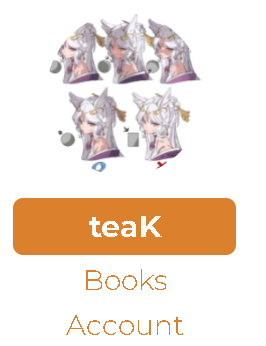

 This page has three functions: borrow in the wishlist section, return
 books in the book section and pay the fine for overdue books.

 **Borrow book:**

 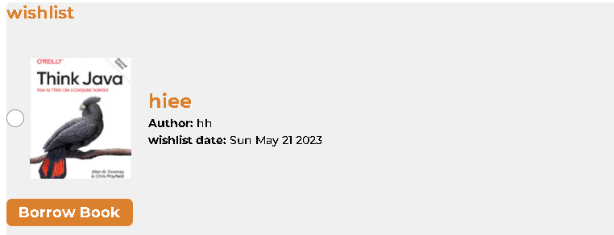

 Borrow button will submit the form to “/users/borrow2” and run
 borrow2.js

 borrow2.js :

 ```javascript

 const Borrow = require('../models/BorrowRecord')

 const WishList = require('../models/WishList')

 var mongoose = require('mongoose');

 module.exports=(req,res) =>{

 const id = req.session.userId;

 var objectId = new mongoose.Types.ObjectId(id);

 console.log(req.body)

 let book = {

 'bookID': req.body.bookID,

 }

 Promise.all

 ([

 Borrow.create(req.body),

 WishList.findOneAndUpdate({userID: objectId.toString()}, {$pull:
 {books: book}})

 ])

 .then(()=>{

 res.redirect('/bookcart')

 })

 }

```

 Here, we need to combine two premade database tables, WishList and
 BorrowRecord to look up books based on bookID and userID. Based on
 userID, we can create a new entry on BorrowRecord, then find the
 corresponding bookID and update the entry, along with pre-defined
 information such as Issued Date and Return Date. A new BookRecord ID
 will be automatically created in MongoDB, which is necessary to
 perform later tasks: Return book and Paying overdue.

 **Return book:**

 

 Return Book function when clicking, it will submit the form to
 “/users/returnBook” and run the returnBook.js

 ```javascript

 const Borrow = require('../models/BorrowRecord')

 var mongoose = require('mongoose');

 module.exports= async (req,res) =>{

 var id = req.body.ID

 console.log(id)

 var objectId = new mongoose.Types.ObjectId(id);

 var user = loggedIn

 var userId = new mongoose.Types.ObjectId(user);

 // Borrow.findOneAndUpdate({bookID : objectId .toString(), userID:
 userId.toString() }, {status: "returned",hasReturned: true}),

 let doc = await Borrow.findOne({bookID : objectId .toString(),
 userID: userId.toString(), 'hasReturned': false })

 if(doc == null) {

 res.redirect('/404')

 };

 console.log(doc)

 doc.hasReturned = true;

 doc.status = 'returned';

 await doc.save();

 console.log("delete done")

 console.log("")

 res.redirect('/bookcart')

 // .then(()=>{

 // })

 }

 ```

 This section requires BorrowRecord entry ID to retrieve information
 about borrowing status. If the selected book has returned, the
 hasReturned attribute will change its Boolean status from “false” to
 “true”, which will trigger entry deletion. The page will be
 automatically updated once the user is redirected to their Book
 Management page.

 **Pay overdue book:**

 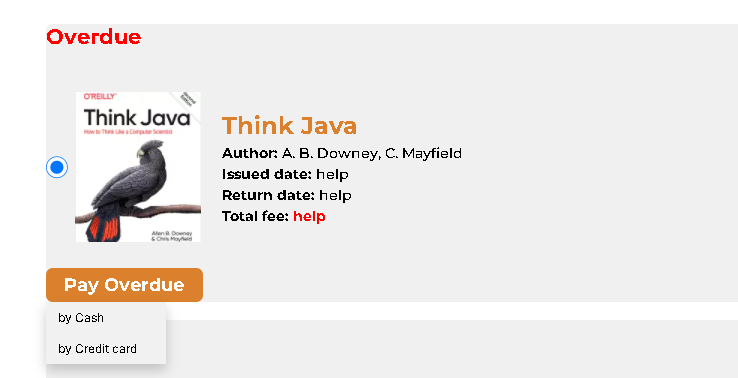

 This button simply leads the user to a payment page. When clicked it
 will drop down two options: by Cash, by Credit card. This is done
 thanks to the part of the script dropdown.js.

 ```javascript

 const Borrow = require("../models/BorrowRecord");

 const Users = require("../models/User.js");

 const sendEmail=require('../controllers/sendEmail')

 module.exports = (req, res, next) => {

 Promise.all

 ([

 Users.find(),

 Borrow.find(),

 ])

 .then(([user, borrow]) => {

 //caculate the date

 if (user.length != 0 && borrow.length !=0) {

 var dif = []

 var due = []

 for (var i = 0; i < borrow.length; i++) {

 var now = new Date().getTime();

 dif[i] = (Math.abs(now - borrow[i].createdAt)) / (1000 * 3600
 * 24);

 due[i] = (Math.abs(borrow[i].dueDate - borrow[i].createdAt)) /
 (1000 * 3600 * 24);

 // dif[i] = 0;

 // due[i] = 0;

 console.log(dif[i])

 console.log(due[i])

 if (dif[i] != due[i] && due[i]- dif[i] <= 1 ){

 console.log("one or less than one day left")

 for (var k = 0; k < user.length; k++) {

 if (user[k]._id.equals(borrow[i].userID) ){

 console.log("help")

 sendEmail(user[k].email,

 'Password reset link', 'the book is almost due bro'

 )

 }

 }

 } else if (dif[i] == due[i] ){

 console.log("time out")

 for (var k = 0; k < user.length; k++) {

 if (user[k]._id.equals(borrow[i].userID) ){

 console.log("help")

 borrow[i].overDue = true

 borrow[i].paymentAmount = 100;

 borrow[i].status = "overdue";

 borrow[i].save()

 }

 }

 }

 }

 }

 next();

 })

 }

 ```

 This is the most complicated section in the User Book Management page,
 as mathematical conditions must be applied as a prerequisite for later
 functionalities. Here, the absolute values of current date and due
 date are calculated to obtain the date difference. If the date
 difference equals to 1, an email message is sent to the user's
 corresponding email to notify them to return the book. If the absolute
 value of current date equals that of due date, it means the book is
 overdue. Then, the server will automatically update the payment
 amount, and the user will select between two method options (by Cash,
 or by Credit Card) to redirect to Payment pages.

## **Search book**

 (Nguyen Huu Minh Quang - 17452)

 Search bar is required for users to look for books quickly. The below
 codes will show a search bar and the results shown when it receives
 inputs from users.

 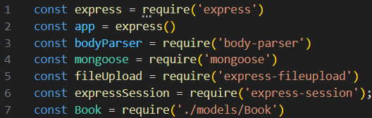

 

- The app.post('/getBooks',async (req,res)=>{...}) code creates a POST
 endpoint /getBooks which listens for incoming requests.

- The let payload = req.body.payload.trim(); code extracts the payload
 value from the request body and trims any leading or trailing
 whitespaces.

- The let search = await Book.find({title :{$regex : new
 RegExp('^'+payload+'.*','i')}}).exec(); code uses the Book model to
 search for books that have a title field matching the regular
 expression generated from the payload value. The regular expression
 ^ matches the beginning of the string while the .* matches any
 character after the payload. The i flag makes the regex
 case-insensitive. The search is an asynchronous operation due to the
 await keyword.

- The search = search.slice(0,10); code limits the search result to at
 most 10 items.

- The res.send({payload: search}); code sends the search result in JSON
 format as the response to the client request.

- The /getBooks endpoint's purpose is to search for books in the
 database based on the provided payload value and return the matching
 books as a response to the client request.

 After that, we need a function to send the data from the frontend,
 showing the results according to what they’ve searched.

 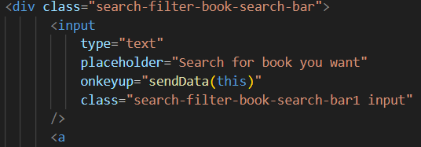

 

 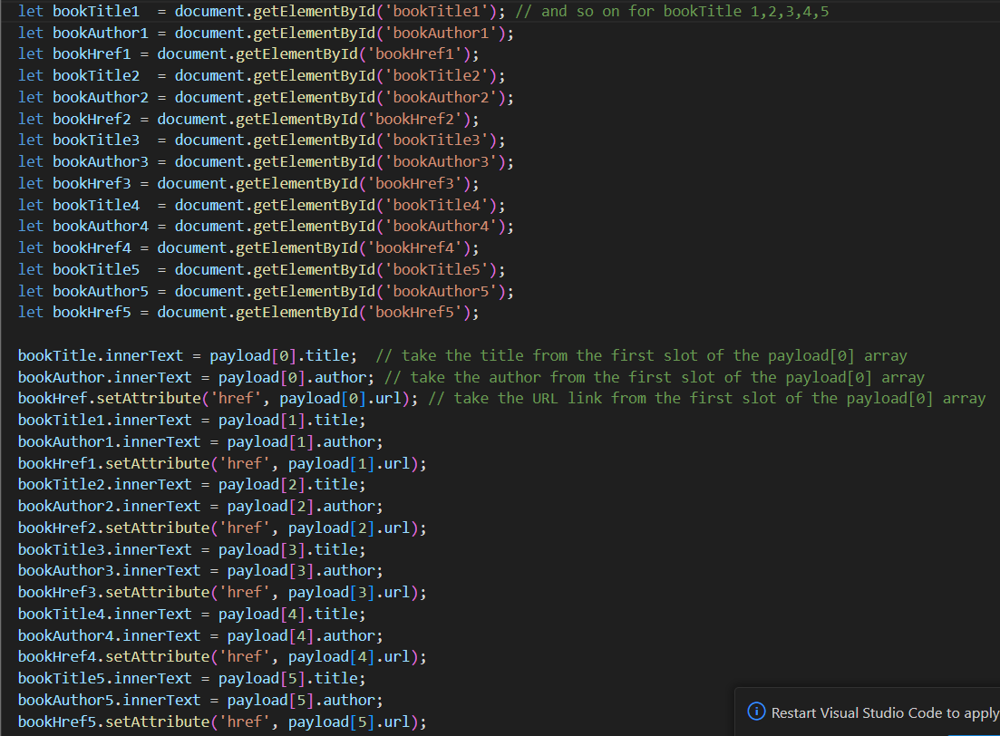

 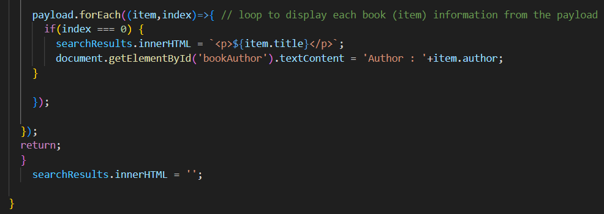

- The function sendData takes an event e as its parameter and is
 responsible for fetching and displaying search results based on the
 user's input in the search bar.

- The second and third lines use regular expressions to extract the
 alphabetical characters and whitespace from the user's input. The
 match variable captures all alphabetical characters and spaces,
  while match2 captures only whitespace.

- The fourth and fifth lines are conditional statements that check if
  > the user's input is either all whitespace or only contains
  > alphabetical characters and spaces. If either of these conditions is
  > true, the search result element is cleared and the function returns.

- The sixth to fourteenth lines perform the main task of the function.
 It sends a POST request to the server with the user's input as the
 payload. Once a response is received, the payload is extracted and
 displayed in the search result element. If there are no search
 results, the element displays a message saying "Sorry. Nothing
  Found." let payload is an array that contains the data given back
 from the database, which will be displayed by the loop
 payload.forEach(item,index).

## **Payment method**

 (Tran Hoang Kim - 17251)

 If the time that users borrow a book is more than the days which the
 library allows them to borrow, users have to pay a overdue fee for
 that book. The payment information will be notified in the user's book
 cart and through email. Users need to pay the fee, otherwise they can
 not borrow more books. At the Overdue list in the Book cart page,
 there are 2 payment methods that will be dropped down when we press
 the Pay Overdue button. Users can choose the payment method that is
 suitable to them.

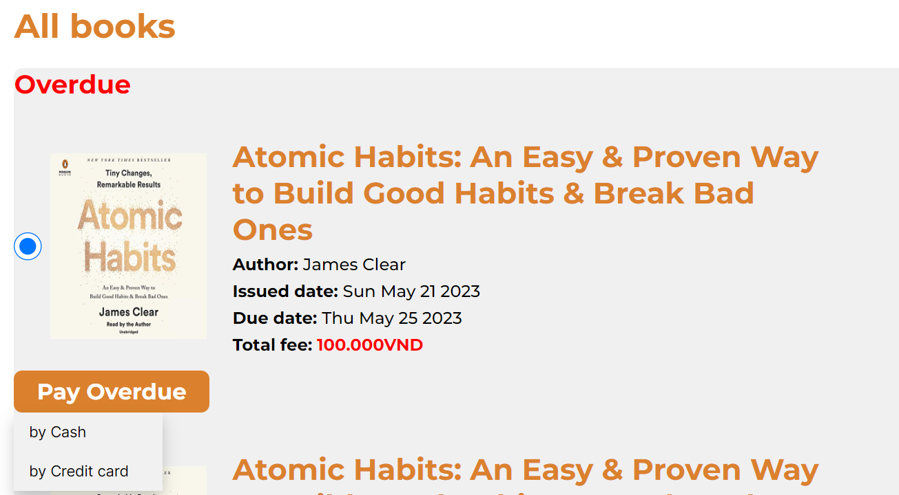

 Check due date function can recognize which books are overdue. After
 that, the server will send a overdue notification to users through
 email:

 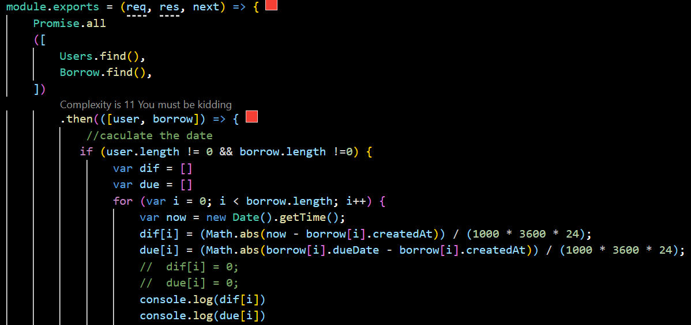

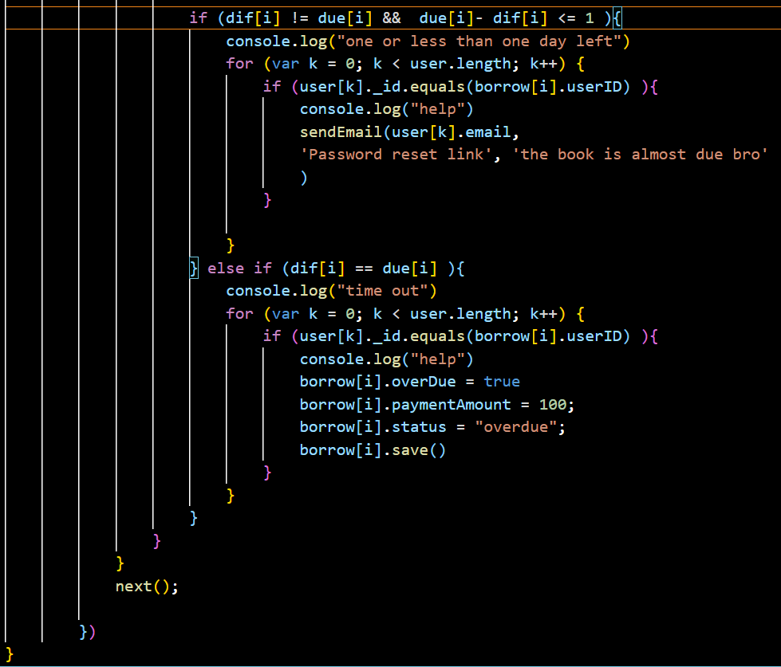

 By paying offline, users bring this confirmation and cash to the
 library's reception to pay their fee.

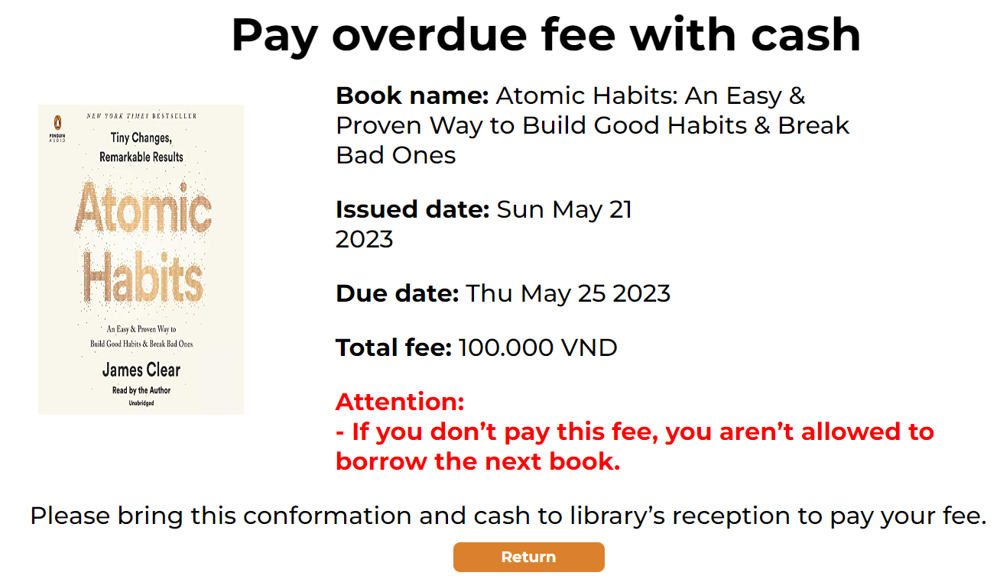

 On the other hand, users can pay online through Digital wallets,
 National banks and International cards. We do not have too much time
 to analyze and connect to the third - party for real payment so after
 clicking on those methods, users will move to the Waiting for payment
 process page.

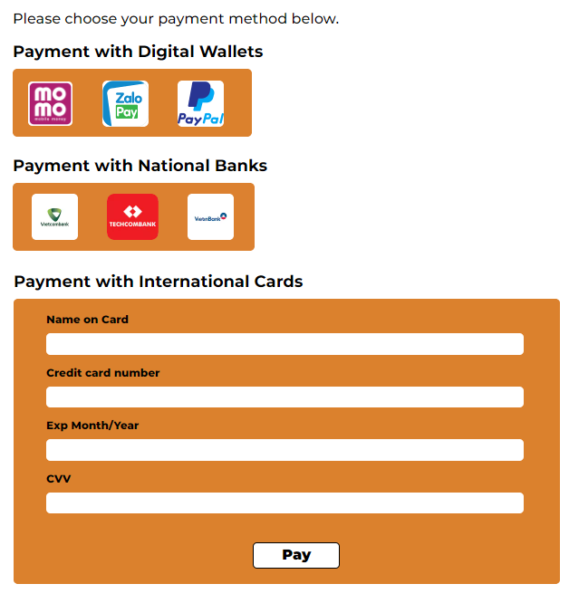

 Waiting for the payment process page is displayed while users make
 payments on other platforms.

 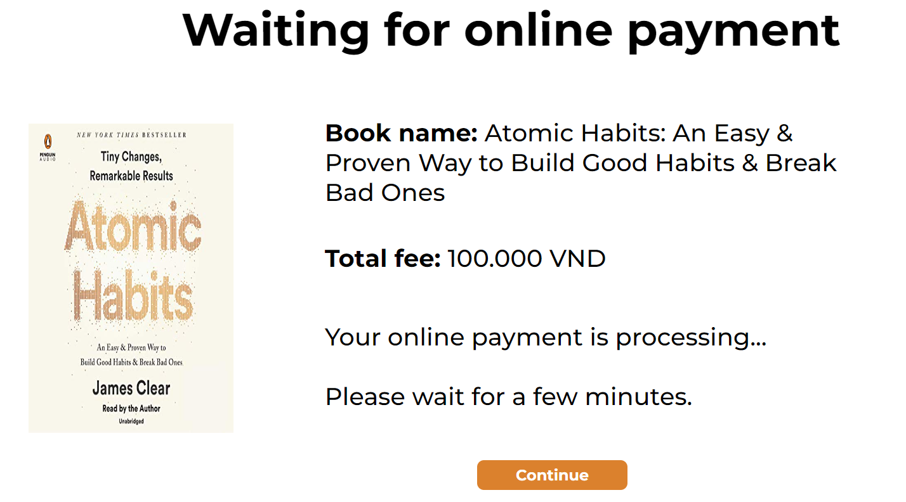

 After clicking on the Continue button, the debt will be updated on the
 Databases of the website through this function in code:

 <span class="mark">Update code image here</span>

 Users will receive a success notification after the payment is
 successful. At that time, their debt had been updated to zero VND.
 Those are all steps for users to pay their overdue fee.

 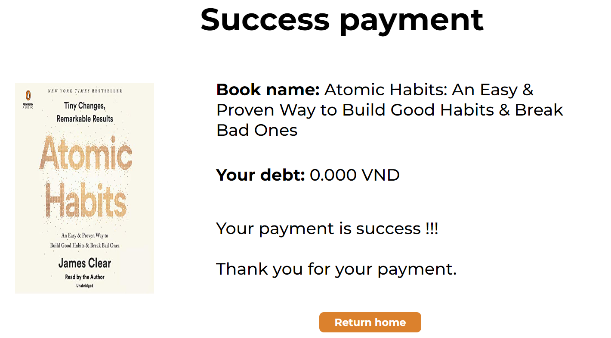

## **The Book Information**

 (Vo Nguyen Minh Duy - 17105)

 Accessible from any User user, Admin user, or unverified user, any
 Book in the database is embedded with title and author when displayed
 on the webpage. Users can access it through clicking the cover image
 and it will redirect to the Book information page.


 On the first part of the Book Information page, the Book Cover image
 is shown on the left side while every Book information, such as title,
 authors, categories, publisher, published year, supported language and
 date it was uploaded to the database. Verified User users are allowed
 to view and make actions with the Wishlist or Borrow button, which
 executes their respective operations, while Admin users and
 non-verified users do not view these buttons.

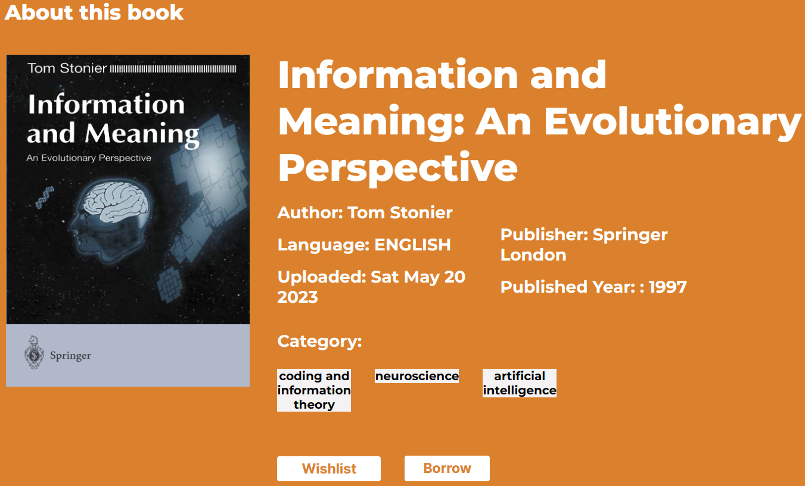

 Below the information table is the preview page, allowing any users to
 view the first 3 pages of the featured book, along with the book's
 synopsis. The synopsis, labeled Summary, can be extended or retracted
 depending on the content.


 Finally, the review section is displayed at the end of the webpage.
 Any user can view the review section, but only authentic User users
 are allowed to make the review and rate the book to be Like or
 Dislike, depending on their own experience. The total rating for the
 Book will be calculated based on number of reviews made as well as
 ratio between Like reviews and Dislike reviews. Each review consists
 of the User’s username, the date the review was uploaded and the
 review itself.

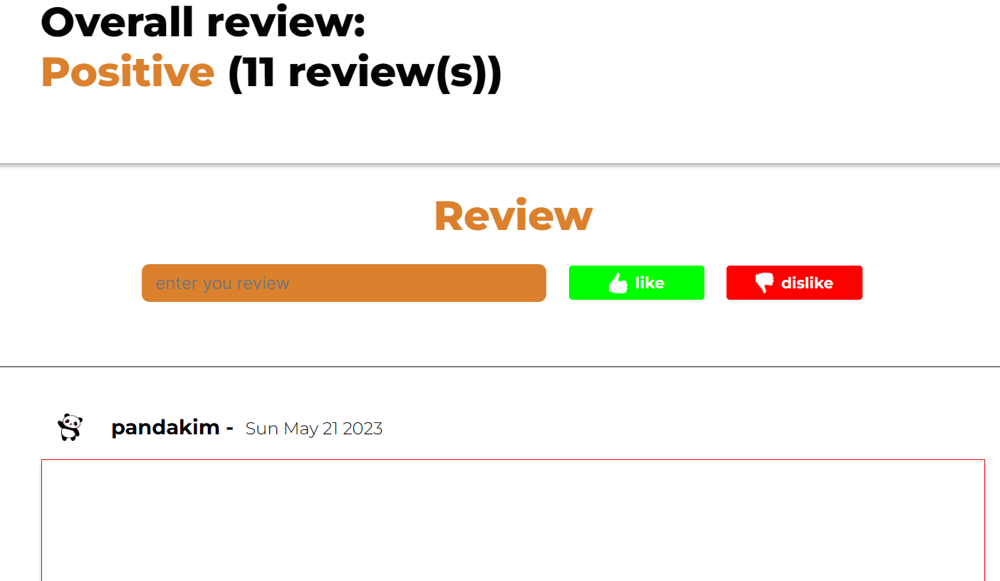

 Due to having accounted for the difference between User user and the
 rest of user types, the code is split so that an actual User viewing
 the book can be recognized and be enabled to make the review, while
 any visitor or Admin user is still able to view the Book without any
 major drawbacks.

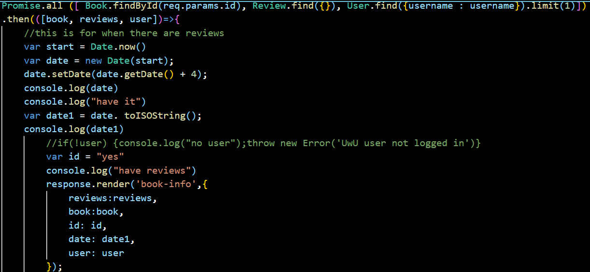

## **The Admin Page**

 (Vo Nguyen Minh Duy - 17105)

 User account and Admin account are independent from each other. While
 an Admin account cannot access certain functionalities such as
 borrowing / wishlist-ing a book as well as making payment for a due
 book, Admin users can view certain statistics summarized with
 interesting books’ information through a chart. The Admin account is
 majorly used to add more User accounts or Book into the database,
 along with modifying or removing from the library those already
 existing.

 To prevent non-Admin users from entering the dashboard or any inner
 function by any means, a middleware is developed in order to check the
 qualification of a LoggedInAdmin global variable. This variable is
 initialized when a valid Admin account is logged in with its Admin
 unique identifier. If the variable is checked null, the user will be
 redirected to the Admin login page in order to log into an actual
 Admin account.

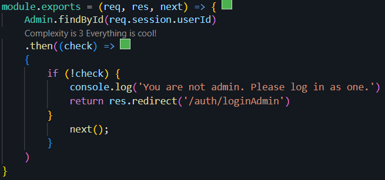

 After logging in, Admin user is redirected to the main dashboard
 displaying information such as Total Users and Total Books in the
 library, number of books currently borrowed. There also shows a chart
 representing comparison between books by certain criteria that can be
 modified internally according to Admin’s preference. The page looks as
 follow:

 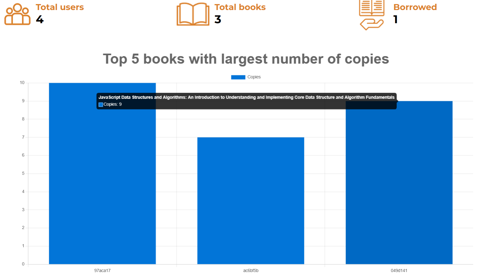

 Scrolling down will display 2 lists, both of which will show top 5
 recently added Books or Users, respectively. The data in the table is
 not interactable, although Admin can use the View More button to be
 redirected to List of Total Books or Users in the library.

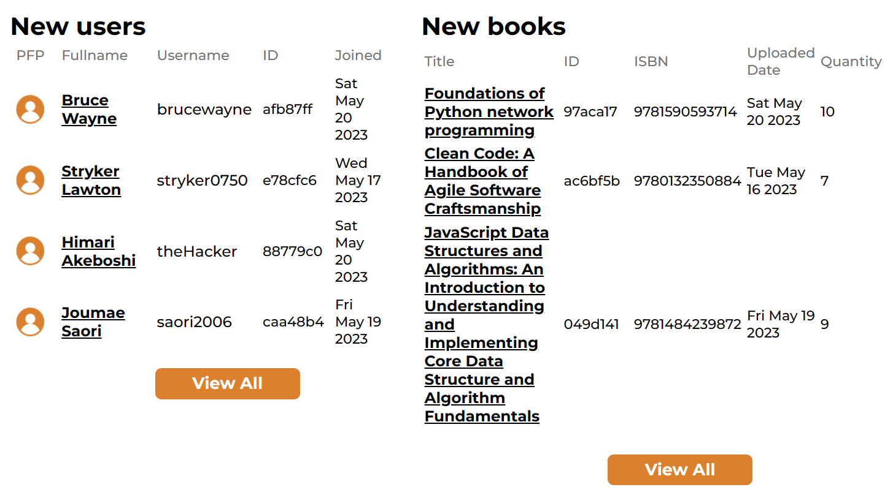

 In order to display the data to the dashboard,double query calls to
 MongoDB to get all information about Books and Users are made at the
 same time. An array of objects containing specific attributes used to
 display on the graph is also constructed priorly so that the data can
 be retrieved later on and parsed onto graph drawing script.

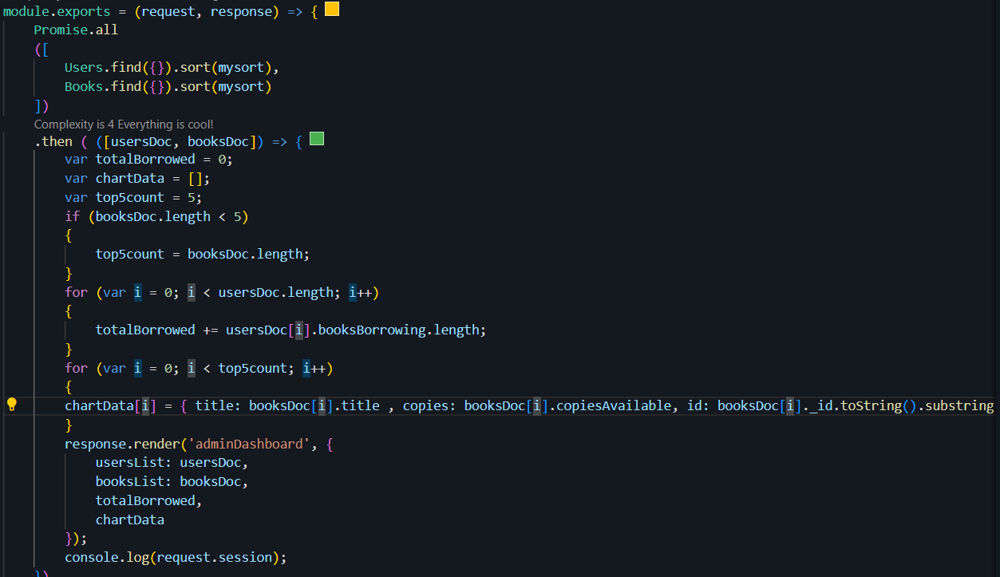

 The following code snippet shows how the already combined chart data
 is collected and a graph is programmatically constructed from the data
 pack. Special configurations are hand-scripted so that hovering each
 bar of an element can display a different attribute associated to that
 element, rather than its own label. This is done on one of graph
 functionalities called tooltips.

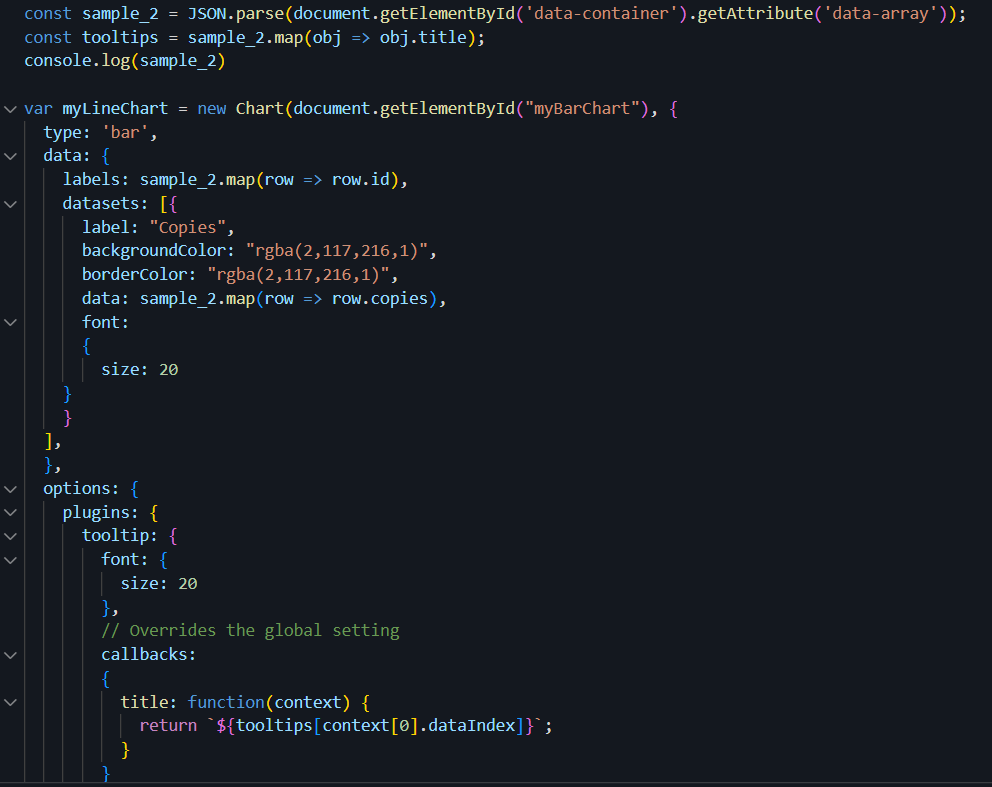

 After the dashboard page, Admin users can press on either User or Book
 button on the orange navigation bar, both of which will take them to
 List of All Users or Books in the library, respectively. Each page
 also has its own Add User or Add Book used to execute said
 functionalities. The data table displays some interesting information,
 as well as 3 tools: Edit the data, Remove the data or View all details
 of the data. The table is heavily customized with the help of a
 community jQuery plugin called DataTables, which by default already
 greatly enhances the normal HTML table with advanced interaction
 features, such as its own search bar, table pagination and control
 over how many data can be listed at the same time.

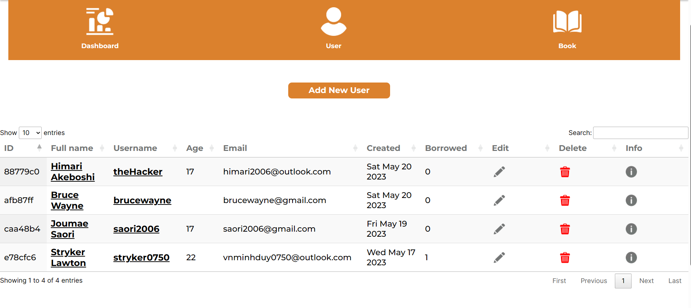

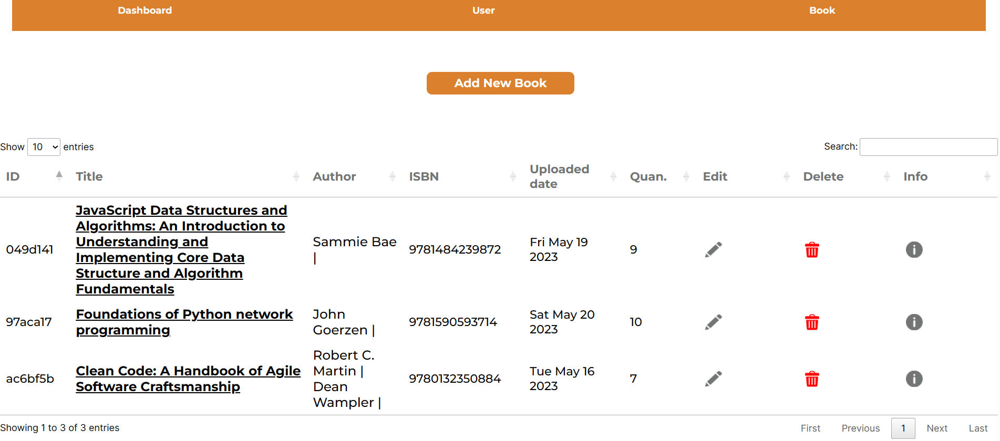

 Providing the data is relatively easy, in which a simple query call to
 the database in order to get every Book or User and parse the result
 to its respective page

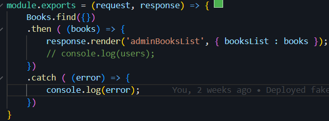

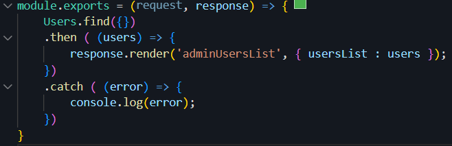

 In the scenario that the Admins want to add a book to the database
 collection, they can access the page through the Add Book button. A
 form is displayed with many sufficient fields to be inputted. Leaving
 any of these fields empty will result in a warning message and prevent
 the submission from being sent. There is also an option to display the
 image of the book cover, should the Admin possess the image source.

 The same guidance and experience is provided should the Admins want to
 add a new Users to the database. There exists password fields, which
 will hide all characters upon being entered. The rest of the fields
 function similarly to Add Book functionality.

 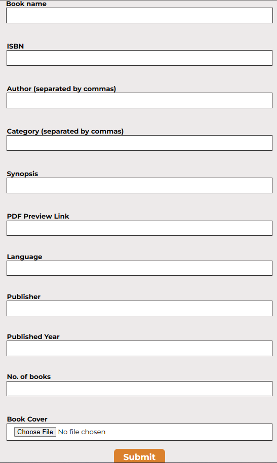

 The data collecting from the page and parsing it into the database is
 slightly complicated. Due to some attributes being identified as an
 Array data type, any related string input from the form must be split
 by the comma and re-save the work onto the attributes of the data
 body. Since the form also contains an image, the middleware
 express-fileupload is installed on the application in order to assist
 with saving the image to its declared destination of the application,
 while its attribute saved in the database will be the directory
 pointed to that image.

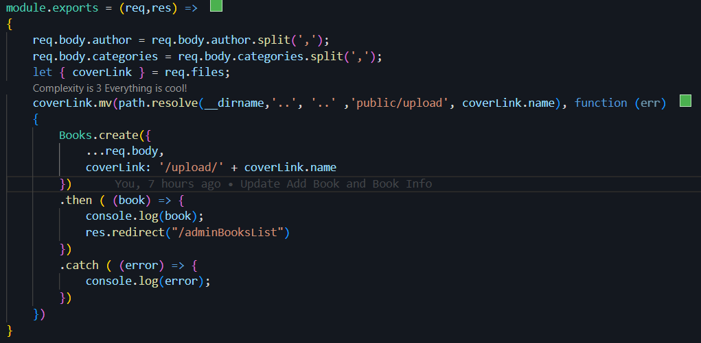

 In addition to the above image saving procedure, when adding a new
 User into the database, the input password must be encrypted so that
 the text is not displayed literally, ensuring its security factor. By
 using middleware called Bcrypt, the input string of the password field
 can be encrypted by applying a hash function up to 10 times. The more
 it is encrypted, the harder it is decrypted.

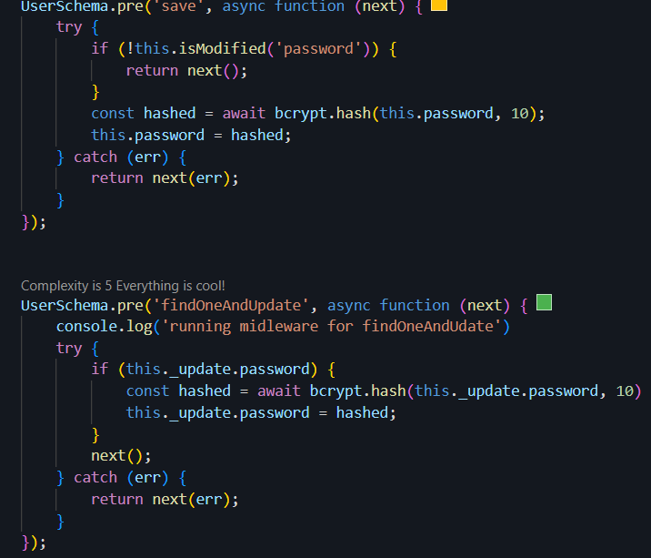

 When a certain situation occurs that the Admin users are demanded to
 modify Book’s information or User’s information, they can access such
 functionality through the pencil icon, labeled Edit Button. Upon
 clicking, the User is greeted with a similar UI to the Add Book or Add
 User functionality, with the exception of every field filled with
 existing relevant data in the database. By this means, any field that
 does not require any modification will retain its value when an Update
 operation is executed with the same parameters to those of the
 original Book or User object. Additionally, the Admin can also view
 wholly expected data of the object so that they can make the change
 conveniently.

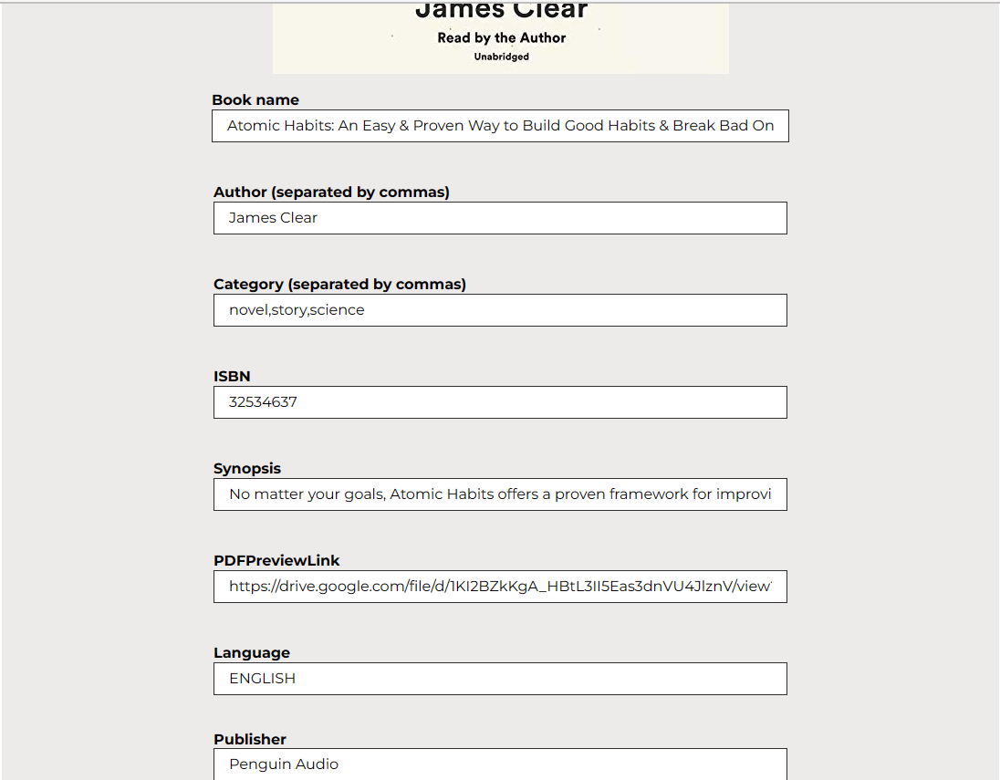

 The coding procedure in the page’s controller is similar to its
 counterpart of the Add Book / User controller, except that the
 operation we need to execute to the database now is the Update
 operation. Furthermore, by default the file uploading field for Book’s
 Cover Image is left empty. Thus it demands a check whether the image
 file is found in a data parameter sent from the page in order to
 execute the Update operation with or without the addition of the image
 link.

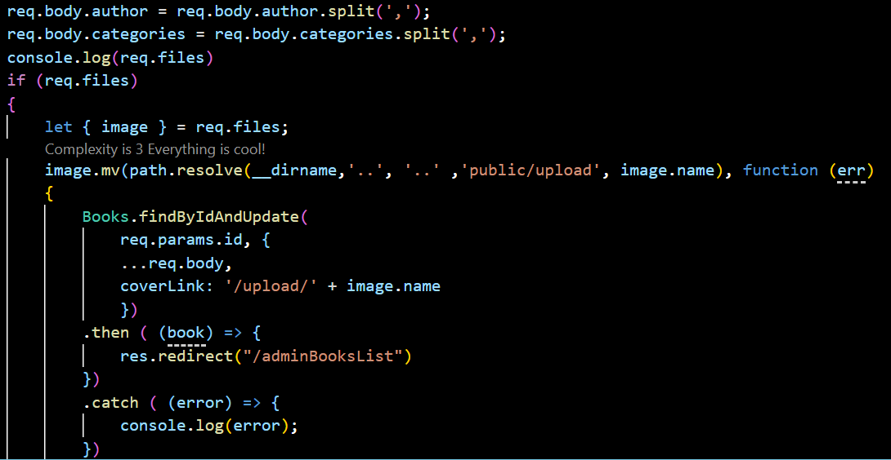

 The last procedure to modify an existing User or Book object in the
 database is Delete functionality, should any of these objects be noted
 to be removed rather than edited. Upon clicking the Delete button,
 Admin users are greeted with a warning page showing every detail of
 the User or Book object. Final Deletion operation is executed when the
 Admin users press on the Confirm button.

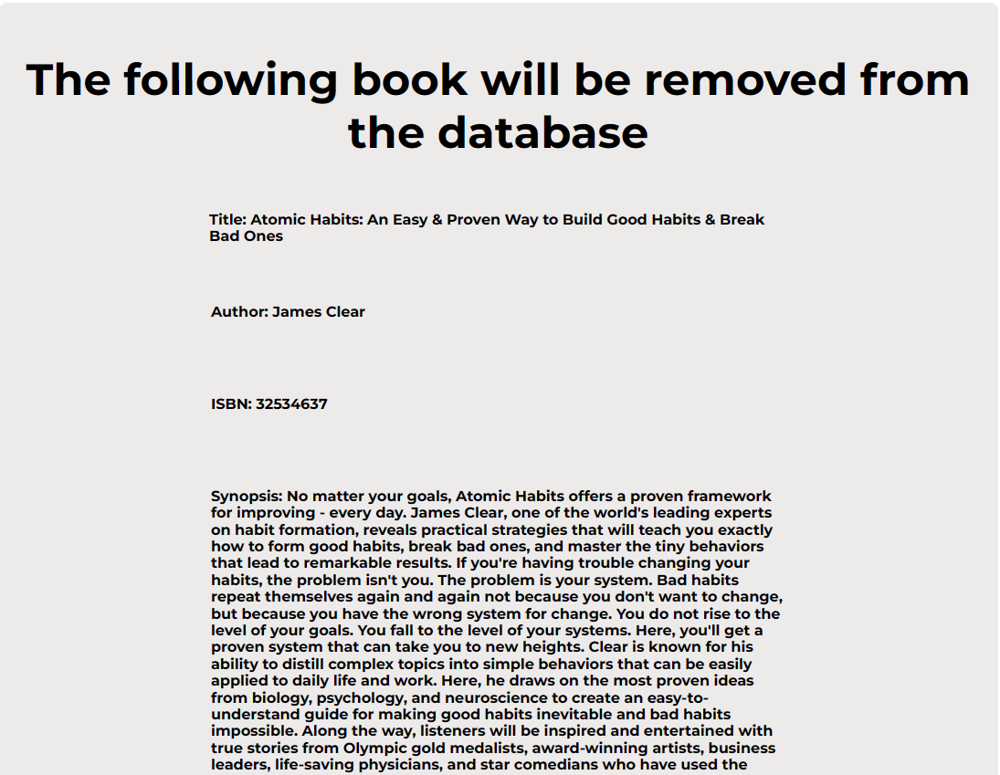

 The code for this page is relatively simple, when the Delete operation
 is executed by finding Book’s or User’s id from the webpage matching
 the object’s unique id. Then, the whole object is deleted from the
 database for good and the Admin user is redirected to the List of
 Books or List of Users, where the objects in the respective database
 are updated.

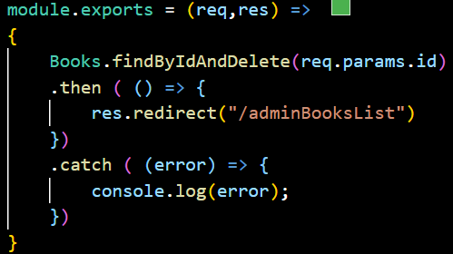

# **Testing**

 All of the developments and testing were done on a variety of laptops
 with various hardware and software configurations. On the software
 side, almost all 6 of us have tested the website on the latest version
 of Google Chrome or Microsoft Edge (both the newer version which is
 based on the open-source components of Chrome as well as the older
 browser on the older Trident web rendering engine), on either Windows
 10 or Windows 11; with one member tested using the latest version of
 Firefox on an Ubuntu-based Linux distribution. We found that
 generally, aside from some scaling issues on devices with smaller
 viewport, the user's hardware shouldn't be a limiting factor to
 experiencing our project, assuming that their web browser is
 reasonably up-to-date.

 One of us has also tested our site on the legacy, no longer supported
 web browser, Internet Explorer, with dismal results. We do not
 encourage our end users to use our project on this browser. As
 mentioned multiple times in this document, the time constraint
 prohibited us from thoroughly testing edge cases as well as normal use
 cases, but we can guarantee that our users will have an experience
 using our project.

# **Result**

 Due to the time constraints as well as our group's inexperience at
 doing projects like this, the end product was delivered at a (very
 much) less than desired state. A not so insignificant amount of
 functions are only partially implemented, however we estimated that
 over 40 percent of our project is at a functional state.

 The following use case are among those that are complete:

- Web Page navigation.

- some user-related activities:

  - register accounts, reset the password via email,

  - edit the user profiles,

  - adding books to individual wishlists,

  - marking books as "borrowing" and marking borrowing books as
   "returned".

- The admin Dashboard and the different overviews.

- Basic functionalities such as Add, Edit, Remove Books or Users for
  Admin account.

- Successful configuration and deployment of NodeJS application to the
 cloud server hosted by Vultr cloud service.

 Even with so little progress, we can proudly say that adopting our
 project will substantially change the workflow of even the most
 efficient organization!

# **Challenges**

 It is unavoidable that hurdles and challenges would arise during the
 project's implementation. It took us many hours to a few days to
 resolve these issues. Here are the four major challenges we faced
 while completing this project:

## **Errors and bugs**

 Errors and bugs were the most evident and critical challenges during
 this endeavor. It happened all the time during the project, from
 converting UI prototype designs into workable scripts to implementing
 different features to handle databases and user traffic. We were able
 to detect and correct issues quickly several times, but due to our
 lack of knowledge, it took us hours, if not days, to successfully
 troubleshoot. Some of the bugs were more complicated than they appear,
 while others were unusual, even among experienced programmers.
 Fortunately, with the help of Dr. Huynh Trung Hieu and Truong Vinh
 Hoang Chau, as well as online forums like StackOverflow and
 GeeksforGeeks, we were able to successfully solve these issues and
 complete the project on time. Additionally, Tra Dang Khoa, our team
 leader, had always encouraged and guided everyone to debug and learn
 new features. We could not have finished the project on time today
 without his hard effort and attention to the team’s progress.

## **First large - scale project**

 Because this was some of our members' first large - scale project,
 tutorials and guidance were necessary so that we could get fundamental
 expertise for this project. However, many of the accessible sources
 were inadequate and insufficient. Certain obstacles had no
 instructions, so we had to develop them from scratch, which severely
 slowed our project's progress. Truong Vinh Hoang Chau, who had prior
 knowledge and experience with web-based system development, informed
 us about this project and offered supplementary reading material at
 the start of the programming exercise, so our learning period was much
 reduced.

## **Gitlab - new platform**

 The transition from GitHub to GitLab was also a challenge in the early
 stages of the project. We were accustomed to using GitHub, so we
 assumed the switch to GitLab - a platform that, like GitHub, utilizes
 distributed source code management technology - would not be too
 tough. However, because the management of these two platforms is
 incompatible in many ways, it took us a long time to merge and pull
 the features from different branches. As a result, conflicting code
 versions and data loss occurred frequently.

## **Team’s communication**

 Communication among team members, as well as keeping team members
 motivated to complete the project, is critical to the project's
 success. Our group includes people who have recently completed their
 exchange program in Germany and returned to Vietnam, thus meeting and
 setting future goals must begin as soon as possible. However, because
 the group had completed some tasks in advance around two weeks before
 the delegation from Germany returned, the individuals from Germany
 experienced considerable difficulties in catching up with the progress
 and adjusting to the team's itinerary. Additionally, the communication
 between members is not always clear, thus leading to many errors.

# **What have we learned?**

 In terms of technical knowledge, we have gained numerous valuable
 lessons and experiences in web-based programming. We researched common
 web programming languages such as HTML, CSS, JavaScript, and several
 applications to create a rather complete web system. We additionally
 acquired insight knowledge about User Interface (UI) and User
 Experience (UX) through doing website interface design projects on
 Figma and Teleport. Furthermore, during the project, Truong Vinh Hoang
 Chau taught us about Node.js, a software system for web servers,
 MongoDB, a NoSQL data system that uses a JSON-like text format for
 management of user data and the books imported on it, and Vultr, the
 cloud platform through which we can publish the finished website on
 the Internet. His instructions were really helpful in overcoming the
 technical constraints that had to be met before the project.

 For better management, every sprint and subtask was assigned and
 divided into boards (sections) in Trello - an online work management
 service - so that everyone would understand their tasks and rearrange
 their schedule better. Every Saturday evening, based on self-reports
 on Trello, the team organized a meeting to evaluate the progress and
 set up new assignments for the upcoming week. Following the project,
 each group member's managerial skills, including time management, work
 management, and communication skills, were greatly improved. This
 group project also provided us with excellent experience in teamwork
 and leadership. Despite the fact that the group was not fully formed
 at first due to some members having to complete their exchange program
 in Germany, we were able to divide responsibilities equitably among
 members, plan multiple meetings, and check each member's progress in
 each sprint to fulfill Agile workflow. Furthermore, this project gave
 everyone a fantastic opportunity to gain experience working in a
 medium-sized group (groups of 7-12 people), which is frequent in
 today's work environments. Everyone in the group had the same right to
 express themselves, come up with fresh ideas, and offer support to one
 another as needed.

# **Future work**

 Some functionalities could not be included into the present web
 platform due to project time constraints. Below are some of the
 features we would want to introduce in the future:

- **Find a book using AI:** Next to the search icon, there will be the
 “Search by book cover” button. User scans the book cover by the
 camera, then the AI will analyze the cover and find that book
- **Membership ranking:** In the user information page, there will be
 the membership rank based on books borrowed, books returned back
 before the due date,... Higher ranking, more discount applied when
 doing transactions.

- **Book delivery to and return from home:** There will be delivery
   people who deliver books to be borrowed and receive books to be
   returned to and from the customer’s home.

- **Online transaction:** Users can pay using e-wallet or bank services.
   Can combine with the “Book delivery” function (enable the delivery
   option after a successful transaction).

- **Improve wishlist button**.

- **True borrow function and read online function**: because right now,
   the borrow function simply adds/updates to the borrow record
   database . What we truly want is that when the user borrows, the
   read option will appear for the user to read online. But because of
   time constraints, we can’t apply this idea.

- **Apply featured book and newly arrived book status**.

- **Improve check due date**: because now it is just a middleware and
   only activated when the user used the website. So in the future we
   want it to check everyday and do it in real time.
   
# **Conclusion**

 This project provides a great opportunity for our team to learn about
 a variety of internet resources that will help us improve our web
 development skills. We hope that this project, in general, and the
 website in particular, can contribute to the university's current
 library system in terms of functionality, security, and user
 experience. We welcome any suggestions to help us improve our product
 in the future.

# **References**

1.  Sach Lap Trinh Nodejs That Don Gian (2020). Retrieved 21 May 2023,
     from
     [<u>https://vntalking.com/wp-content/uploads/2020/04/sach-lap-trinh-nodejs-that-don-gian-sample.pdf</u>](https://vntalking.com/wp-content/uploads/2020/04/sach-lap-trinh-nodejs-that-don-gian-sample.pdf)

2.  Mongoose v7.2.0: Getting Started. (2023). Retrieved 21 May 2023,
     from
     [<u>https://mongoosejs.com/docs/</u>](https://mongoosejs.com/docs/)

3.  Chart.js | Chart.js. (2023). Retrieved 21 May 2023, from
     [<u>https://www.chartjs.org/docs/latest/</u>](https://www.chartjs.org/docs/latest/)

4.  Manual. (2023). Retrieved 21 May 2023, from
     [<u>https://datatables.net/manual/</u>](https://datatables.net/manual/)

5.  <span class="mark">(N.d.). Retrieved from
     [<u>https://www.vultr.com/</u>](https://www.vultr.com/)</span>

6.  GeeksforGeeks | A computer science portal for geeks. (2023).
     Retrieved 21 May 2023, from
     [<u>https://www.geeksforgeeks.org/</u>](https://www.geeksforgeeks.org/)

7.  <span class="mark">Content editing - edit button in JavaScript.
     Retrieved from
     [<u>https://codepen.io/JoannaEl/pen/ZjaBvr</u>](https://codepen.io/JoannaEl/pen/ZjaBvr)</span>

8.  mongoose?, G., & Rehman, A. (2020). Get Top five max results based
     on sub document mongoose?. Retrieved 21 May 2023, from
     [<u>https://stackoverflow.com/questions/65195672/get-top-five-max-results-based-on-sub-document-mongoose</u>](https://stackoverflow.com/questions/65195672/get-top-five-max-results-based-on-sub-document-mongoose)

9.  Expand a box/ div using JavaScript (2022). Retrieved 21 May 2023,
     from
     [<u>https://www.youtube.com/watch?v=Et-VKwFCYIQ&ab_channel=KhanCoding</u>](https://www.youtube.com/watch?v=Et-VKwFCYIQ&ab_channel=KhanCoding)

10. How to Install Node.js on Ubuntu and Update npm to the Latest
     Version. (2020). Retrieved 21 May 2023, from
     [<u>https://www.freecodecamp.org/news/how-to-install-node-js-on-ubuntu-and-update-npm-to-the-latest-version/</u>](https://www.freecodecamp.org/news/how-to-install-node-js-on-ubuntu-and-update-npm-to-the-latest-version/)

11. Install MongoDB Community Edition on Ubuntu
    <span class="mark">(2023). Retrieved 21 May 2023, from
    [<u>https://www.mongodb.com/docs/manual/tutorial/install-mongodb-on-ubuntu/</u>](https://www.mongodb.com/docs/manual/tutorial/install-mongodb-on-ubuntu/)</span>

12. PM2 - Quick Start. (2023). Retrieved 21 May 2023, from
    [<u>https://pm2.keymetrics.io/docs/usage/quick-start/</u>](https://pm2.keymetrics.io/docs/usage/quick-start/)
